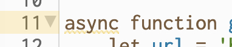

### The Fetch API

[`Fetch`](https://developer.mozilla.org/en-US/docs/Web/API/Fetch_API) is a built-in Javascript function for making discreet HTTP calls in the browser. For example, you can use it to get some data from a weather API, perhaps based on some user input like their city, or you could load an image from the [GIPHY API](https://developers.giphy.com). You can also use `fetch` to send data from your user and save it yourself, in which case you might be running your own server. 

`Fetch` returns a [Promise](https://developer.mozilla.org/en-US/docs/Web/JavaScript/Reference/Global_Objects/Promise) object, which runs asynchronously and requires special handling. This may feel awkward at first, but it's a very practical once you understand it. 

To use `Fetch`, first you provide a URL as it's first argument. I have a good free API called [Magic 8 Ball API](https://8ball.delegator.com).

> Note: You will see me use single and double quote interchangeably throughout the class as Javascript is pretty lenient with this.

```js
let url = 'https://8ball.delegator.com/magic/JSON/'
let question = url + 'Will I ever give you up?'
let answer = fetch(question)
console.log(answer)

// prints '> Promise {<pending>}'
```

As we can see, `fetch` has returned a Promise, which is sort of like saying 'Your results may be pending, but I *promise*, I will pass them your way as soon as I am done."  

In order to process a Promise, we could use `.then` syntax, which takes a function and passes that function the response from the API call.  But there is another way that I prefer which also teaches an important concept.

### Async / Await

If we encapsulate the `fetch` call inside of an `async` function and use the `await` keyword, we can tell Javascript to wait until our code is finished before moving to the next line.  Check it out.

```js
function async getGif() {
    let url = 'https://8ball.delegator.com/magic/JSON/'
    let question = url + 'Will I ever give you up?'
    let answer = await fetch(question) // now our code waits!
    console.log(answer) // no longer a Promise, but a Response object
    let data = await answer.json() // transforms Response object useable data, also a Promise
    console.log(data) // prints a regular JS object which we can use to access the API data

// prints...
// ▼ {magic: Object}
// {
//     magic: {
//         question: "Will I ever give you up",
//         answer: "Ask again later",
//         type: "Neutral",
//     } 
}
```

So there we have it - now our code waits for the line above it to be finished before moving to the next line!  Ohhh the powerrrrrr!!!!!

But wait, what if something goes wrong?

### Try / Catch Block

We can handle any errors that arise in this process by using a `try / catch` block.  Here's the code:

```js
function async getGif() {
    let url = 'https://8ball.delegator.com/magic/JSON/'
    let question = url + 'Will I ever give you up?'

    try {
        let answer = await fetch(question) // now our code waits!
        console.log(answer) // no longer a Promise, but a Response object
        let data = await answer.json() // transforms Response object useable data
        console.log(data) // prints a regular JS object which we can use to access the API data
    } 
    catch (error) {
        console.error(error.message) // prints in RED!
    }
}
```


>Now, you might start to ask yourself, what is that yellow business highlighting the word `async` in my p5 web editor... 
>
>  
>
>That is where the edges of our class start to spill over into a world in which p5 will not entirely jive. And that's ok. As I said before, p5 is a walled garden with very many beautiful things inside of it, living growing... But outside of that garden, things can get pretty overwhelming pretty quick. The goal here is to have you be able to ultimately set out on your own adventures!  Trust me, you will always love the garden for all its beauty and nostalgia.  But you'd be pretty miffed if no one told you about the things that are on the other side of the wall...

### Promises

So `fetch` returns a Promise by default. But we can write our own Promises to satisfy any conditions we choose.  Or even to make our own 'sleep' function, which, unlike Python, Javascript does not have.

```js
const sleep = ms => new Promise(r => setTimeout(r, ms))
```

Take a minute to look at this if you're feeling confused and let's talk about why this works.. A Promise takes two functions as arguments. The first is usually called 'resolve' and the second 'reject'.  We could of course call them anything we like, but the order in which we give them matters.

In our sleep example above, we didn't supply a reject function and we immediately ran the 

### Dealing with Objects

The second option that you can give to the `fetch` object is 'options'.  You'll see this generic term throughout documentation and it usually means a Javascript object with a number of key/value pairs that have a specific meaning to what you're working with.  In our case, `fetch` has many options you can specify.

Many times when you're working with API's, you're going to get either JSON data, a data Blob, or... well it depends on what the API is up to!  For now, let's look at what an object is and how we can 

Here's your assignment for this class which is due Tuesday: [Assignment 2](../course-outline.md#module-2---advanced-javascript-concepts)  
Drop-in hours tomorrow and Monday morning: [Sign up here](https://calendar.google.com/calendar/selfsched?sstoken=UU83Y25Jd3FfQnhjfGRlZmF1bHR8MTcyMDRkOTExMjgzY2QxOTVhYmFhZjM4MmRiMzg1MmM)

Links from class:

- [Simple Magic 8 Ball p5 sketch from class](https://editor.p5js.org/rostaccoli/sketches/ohTtLdCBm)
- [HTML Input tag with placeholder attribute](https://www.w3schools.com/tags/att_input_placeholder.asp)
- [Reference for p5 Element](https://p5js.org/reference/#/p5.Element)
- [Proton VPN](https://protonvpn.com/)

Additional Links:  
- [p5.js Simple Magic 8 Ball, with alert if no question](https://editor.p5js.org/rostaccoli/sketches/n4KL92eKQ)
- [p5.js Animated GIFs with GIPHY API Call](https://editor.p5js.org/rostaccoli/sketches/FWnxSy_aw)
- [Get an API key at GIPHY Developer Website](https://developers.giphy.com/dashboard/)
- [Coding Train Video for Fetch](https://www.youtube.com/watch?v=tc8DU14qX6I&ab_channel=TheCodingTrain) with [examples](https://github.com/CodingTrain/Intro-to-Data-APIs-JS)