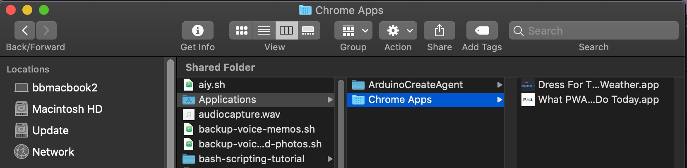

# Progressive Web Apps and You

[PWA Boilerplate Repo](https://github.com/billythemusical/recode-pwa-boilerplate)
[Responsive Web Design with Media Queries](https://www.w3schools.com/css/css_rwd_mediaqueries.asp)
[Debug Console for Safari iOS](https://www.lifewire.com/activate-the-debug-console-in-safari-445798)

Class discussion  
- https://twitter.com/jack/status/1595864501437583367?s=20&t=AZrZvlU99AdRr_TZEzhM9A
- https://neeva.com/search?q=apple+app+store+lawsuit&src=nvobar
- [PWA Library](https://appsco.pe/)